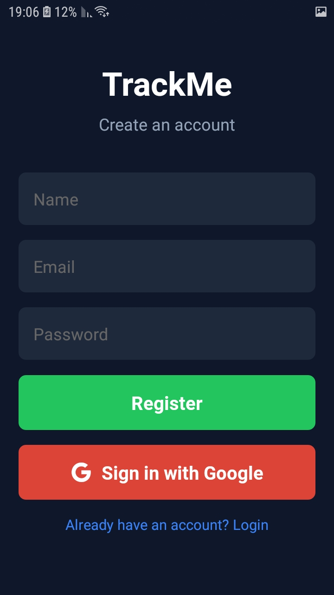
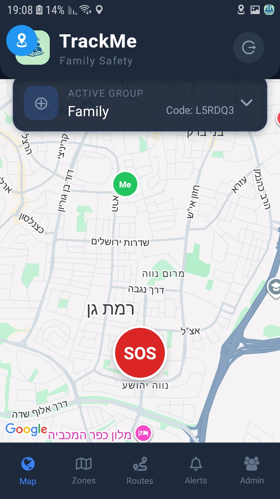
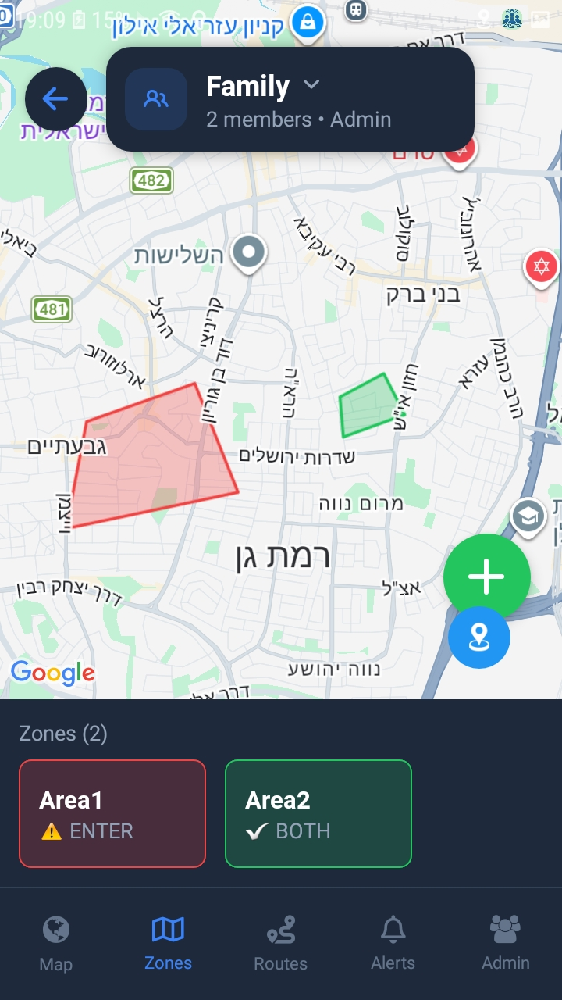
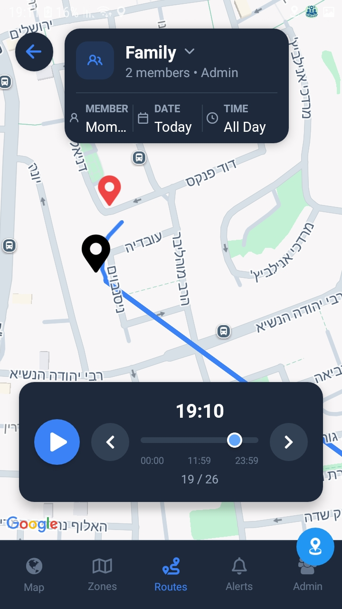
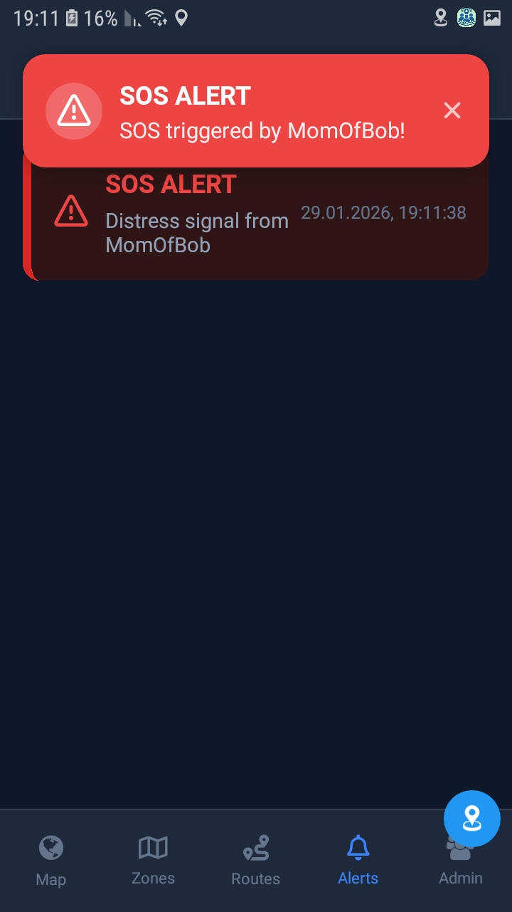
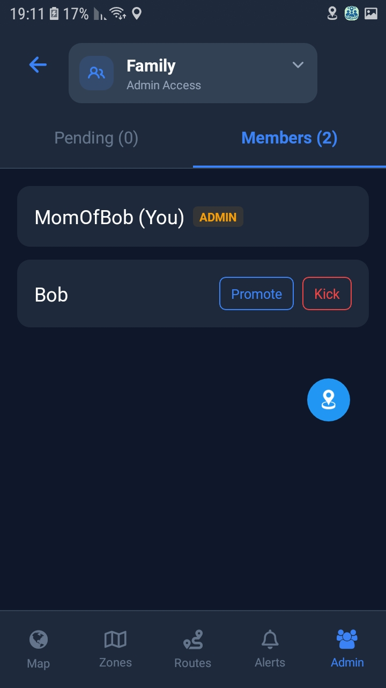

# 📍 TrackMe - Real-Time Group Safety Network

**TrackMe** is a location-based IoT platform designed to enable groups (families, travelers, etc.) to maintain real-time safety tracking. The system allows users to define geofenced areas on a map and provides immediate automatic alerts when group members enter or exit these zones.

The system was engineered with a focus on **Scalability**, **Cloud Cost Optimization**, and **High-Performance** real-time data processing.

---

## 🎬 Demo Video

<div align="center">
  <a href="https://www.youtube.com/watch?v=_zm1W0CrWAg">
    
  </a>
</div>

---

## 👀 Screens

   
 
## 🚀 Key Features

* **Live Location Tracking:** Real-time visibility of group members on an interactive map.
* **Smart Geofencing:** Users can define dynamic polygons (Safe Zones / Danger Zones) and receive Push Notifications upon entry/exit.
* **Background Monitoring:** A resilient background module (Headless Task) that tracks location even when the app is closed to conserve battery and ensure safety.
* **Event-Driven Architecture:** Asynchronous data processing pipeline designed to handle high concurrency and ensure fault tolerance.
* **Cost-Effective Infrastructure:** Cloud infrastructure leveraging Spot Instances to minimize operational costs.

---

## 🛠 Tech Stack

### 📱 Client (Mobile)
* **Framework:** React Native (Expo/CLI) with **TypeScript** for type-safe cross-platform development.
* **Maps:** `react-native-maps` for complex polygon rendering and smooth live marker updates.
* **State & Networking:** `Axios` (w/ Interceptors) + `Context API`.
* **Real-Time:** `socket.io-client` for bi-directional communication (WebSockets) replacing inefficient polling.
* **Auth:** OAuth 2.0 via `react-native-google-signin`.
* **Background Tasks:** Native modules (`expo-task-manager`) for persistent location tracking.

### 🔌 Backend (Microservices)
* **Framework:** NestJS (Monorepo structure).
* **Architecture:** Event-Driven Microservices (API Gateway + Processing Unit).
* **Message Broker:** **Apache Kafka** for decoupling services and buffering high-throughput location data.
* **Database:** **PostgreSQL** with **PostGIS** extension for efficient spatial queries (`ST_Contains`).
* **Caching & Buffering:** **Redis** utilized for Write-Behind caching and a Pub/Sub mechanism for live updates.

### ☁️ DevOps & Cloud (AWS)
* **IaC:** **Terraform** - Full infrastructure definition as code.
* **Compute:** AWS **ECS Fargate** running on **Spot Instances** (Cost Optimization strategy).
* **Network:** Custom **VPC**, **Application Load Balancer (ALB)**, with strict Security Group segmentation.
* **Security:** **AWS Secrets Manager** for credential rotation and secure storage; **RDS** isolated in Private Subnets.
* **CI/CD:** GitHub Actions -> Amazon **ECR** -> ECS Rolling Update.
* **Monitoring:** AWS **CloudWatch** for centralized logging and debugging.

---

## 🏗 System Architecture & Engineering Highlights

The system was designed to handle a specific challenge: A **Write-Heavy Workload** resulting from thousands of incoming GPS updates per second.

### 1. Handling Throughput with Kafka & Redis
To prevent database bottlenecks caused by raw disk I/O:
1.  The **API Gateway** accepts the location payload and immediately produces an event to **Kafka**.
2.  The **Processor Service** consumes messages at its own pace.
3.  **Write-Behind Pattern:** Locations are buffered temporarily in a **Redis List** (In-Memory).
4.  A background CRON job performs a **Bulk Insert** to PostgreSQL every few seconds.
    > *Result: Reduced database I/O load by over 80%.*

### 2. Spatial Analysis with PostGIS
Instead of performing heavy geometric calculations in the Node.js application layer:
We leverage **PostGIS** native capabilities. Queries such as "Is User X inside Polygon Y?" are executed directly at the database level using spatial indices (GIST), ensuring single-digit millisecond response times.

### 3. Cloud Cost Optimization
As an MVP, economic efficiency was a priority:
* **Spot Instances:** The ECS Cluster is configured to run on **Fargate Spot**, reducing compute costs by approx. 70%.
* **Network Trade-off:** Instead of using an expensive NAT Gateway, the architecture utilizes Public Subnets with tightened **Security Groups**, allowing containers to access external services (Google Auth, etc.) securely without the added infrastructure cost.

---

## 💻 Getting Started (Local Development)

The project includes a `docker-compose` file that spins up the entire development environment (DB, Broker, Cache) with a single command.

### Prerequisites
* Node.js > 18
* Docker & Docker Compose
* React Native Environment setup

### Installation

1.  **Clone the repository**
    ```bash
    git clone [https://github.com/your-username/trackme.git](https://github.com/your-username/trackme.git)
    cd trackme
    ```

2.  **Start Infrastructure (Kafka, Postgres, Redis)**
    ```bash
    docker-compose up -d
    ```

3.  **Install Dependencies (Monorepo)**
    ```bash
    npm install
    ```

4.  **Run Services**
    ```bash
    # Terminal 1: API Gateway
    npm run start:api
    
    # Terminal 2: Processor Service
    npm run start:processor
    
    # Terminal 3: Mobile App
    cd apps/mobile && npm start
    ```

---

## 📂 Project Structure
trackme/  
├── apps/  
│ ├── mobile/ # React Native App  
│ ├── api/ # NestJS API Gateway (Socket.io + HTTP)  
│ └── processor/ # NestJS Background Worker (Kafka Consumer)  
├── libs/ # Shared libraries (Database Entities, DTOs)  
├── terraform/ # AWS Infrastructure code  
└── docker-compose.yml # Local development environment

---

## 📞 Contact

**Daniel Michaelshvili** - Software Developer

[LinkedIn](https://www.linkedin.com/in/daniel-michaelshvili-68b188212/) | [Email](danielmich0824@gmail.com)
